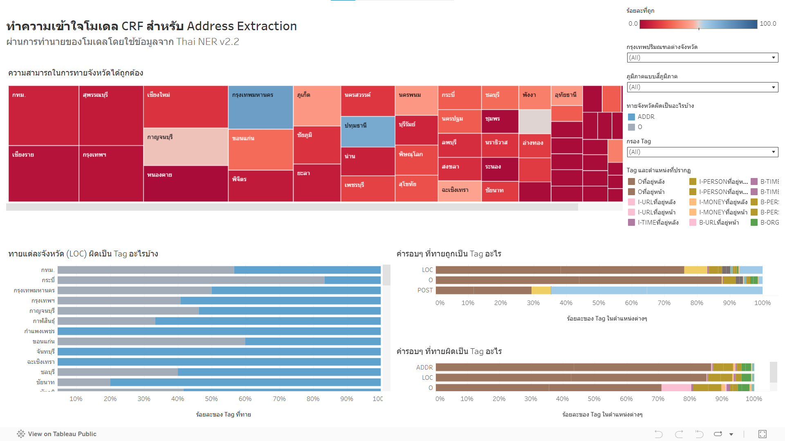

# Visual-Analytics-for-CRF

This project involved the creation of an interactive dashboard 📊 to analyze the performance of a Conditional Random Field (CRF) model trained for Thai address extraction 🇹🇭. The dashboard provides insights ✨ into the model's accuracy in identifying key address components, particularly provinces.

[Link to Dashboad](https://public.tableau.com/views/InfoVisModelInterpretation2/2_1?:language=en-GB&:sid=&:redirect=auth&:display_count=n&:origin=viz_share_link)

## Key Visualizations

- **Province Prediction Accuracy:** A treemap visualizing the percentage of correct province predictions ✅, where the size of each rectangle represents the frequency of the province in the dataset and the color represents the prediction accuracy. A diverging color scale is used, ranging from red (0% accuracy) to blue (100% accuracy), allowing for a visual comparison of prediction success across different provinces.
- **Incorrect Province Tagging:** A stacked bar chart 📊 illustrating the percentage of times each province (LOC tag) was incorrectly predicted as other tags. This highlights common misclassifications.
- **Surrounding Word Tagging Analysis:** A 100% stacked bar chart 💯 showing the distribution of predicted tag categories for words surrounding correctly and incorrectly identified O, ADDR, and POST tags. This helps understand the contextual factors influencing prediction accuracy.

## Interactive Features

- **Regional Filtering:** Users can filter ⚙️ the visualizations to focus on specific regions: Bangkok and Metropolitan area, and other provinces.
- **Details-on-Demand:** Hovering 🖱️ over elements in the visualizations reveals additional information. For example, hovering over a segment in the "Incorrect Province Tagging" chart displays the specific incorrect tag and its percentage for that province.
- **Sortable Province Accuracy Chart:** The "Province Prediction Accuracy" bar chart can be sorted ⇅ in ascending or descending order based on the accuracy rate. [Link to Dashboad (Bar chart version)](https://public.tableau.com/views/InfoVisModelInterpretation/sheet3?:language=en-GB&:sid=&:redirect=auth&:display_count=n&:origin=viz_share_link)

## Data and Task

The dataset utilized was derived from the pythainlp/thainer-corpus-v2.2 📚. The original NER tags B-LOCATION and I-LOCATION for provinces, sub-districts, and districts were unified into a single LOC tag. Similarly, B-ZIP was relabeled as POST to align with the model's predicted tags and facilitate analysis. Thai province, sub-district, and district data from https://github.com/ThepExcel/download/blob/master/ThepExcel-Thailand-Tambon.xlsx 🔗 was used for this tag transformation.

## Insights and Findings

Our initial hypothesis 💡 was that the CRF model would perform less accurately on provinces outside of Bangkok and its vicinity. The developed analytical system confirmed this hypothesis:

- **Regional Accuracy Disparity:** The "Province Prediction Accuracy" chart 📈, in conjunction with the regional filter, clearly demonstrates a higher percentage of correct LOC predictions for Bangkok and Metropolitan provinces  compared to other provinces. Furthermore, when examining performance by region, the Northern region showed the highest accuracy among non-Bangkok areas, while other regions exhibited similar performance. The "Incorrect Province Tagging" chart further revealed that incorrect LOC predictions frequently resulted in the ADDR tag.
- **Frequency vs. Accuracy:** The "Province Prediction Accuracy" treemap char *or bar chart version) 📈 indicated that the frequency of a province's appearance in the dataset did not directly correlate with the model's prediction accuracy for that province 🤔.
- **Contextual Tagging Patterns:** Analysis of the surrounding words for misclassified POST tags 🏷️ showed a prevalence of the URL tag. Conversely, correctly identified POST tags were often surrounded by B-LOCATION or I-LOCATION tags 📍, as evidenced by the "Surrounding Word Tagging Analysis" chart.

  
This project showcases my ability to:

- Perform data preprocessing and feature engineering 🛠️ for Natural Language Processing tasks.
- Develop insightful data visualizations 📊 to communicate complex model performance metrics.
- Design interactive dashboards ⚙️ to facilitate exploratory data analysis.
- Formulate and validate hypotheses 🤔 through data-driven analysis.
- Extract meaningful insights ✨ from model behavior and present them clearly 📢.
